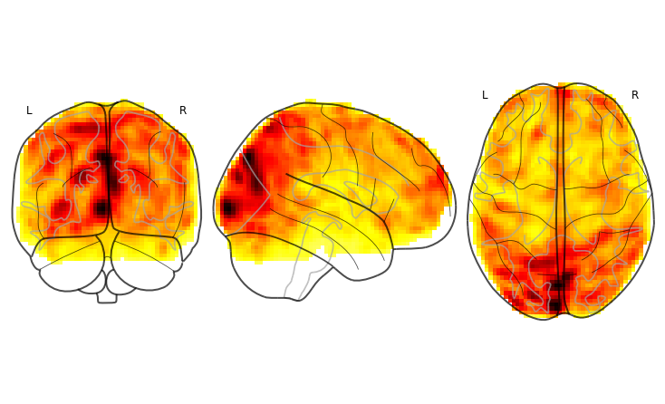

<h1 align="center"> ASDNet </h1>

This is an ongoing research project that attempts to diagnose Autism Spectrum Disorder (ASD) by classifying function magnetic resonance images (fMRIs) with convolutional neural networks (CNNs).  A great deal of preparatory work has gone into this project leaving much work still to be done in the classification/modeling area.  This project is configured for Google Colab with a Tensor Processing Unit (TPU) for training, Google Cloud Storage (GCS) for data, model, and results retrieval/storage, and Coral Edge coprocessor for inference.  

This repo is the **1st of 2 repos** for this project.  The 2nd repo can be found at https://github.com/ericcchase/asd_mri_prediction_app.git 

--- 

<u> This repo focuses on: </u>

**Data Augmentation**
Data augmentation was explored and benchmarked and the techniques can be found in the *augmentation.Augmentor* class in the asd_tools directory.  These augmentation techniques were chosen and defined to work optimally with a TPU processor.

**Modeling Architectures/Hyperparameters**

**Storing Models & Results**

**Model Conversion**

